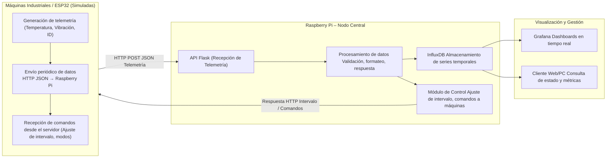
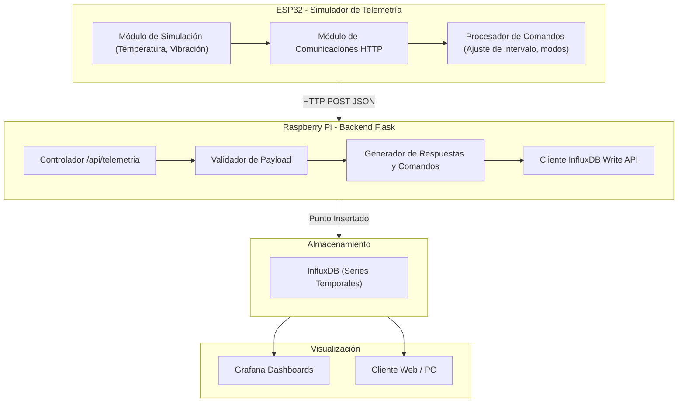
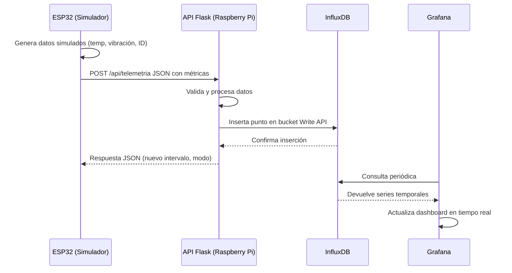

# SCADA Industrial IoT - Sistema de Monitoreo y Control Distribuido

## Presentado por: 
### Rafael Ricardo Torres Choperena || Cristian David Chalaca Salas
### Motivación

Muchos equipos industriales, especialmente aquellos con varios años de operación, presentan limitaciones que dificultan su integración con plataformas modernas de supervisión y análisis. Entre las principales dificultades se encuentran:

- Falta de capacidad para enviar datos hacia la nube o sistemas externos.
- Ausencia de mecanismos de respaldo automático.
- Interfaces locales de usuario obsoletas o inexistentes.
- Costos elevados al intentar adaptar hardware adicional a cada máquina.
- Baja capacidad de monitoreo remoto y toma de decisiones basada en datos.

Estas carencias dificultan la trazabilidad, el análisis en tiempo real y la gestión centralizada de la producción. A medida que crece la demanda de integración digital en entornos industriales, se requiere una alternativa que permita modernizar máquinas existentes sin necesidad de modificar su hardware interno.

### Descripción General de la Solución

El proyecto implementa un sistema SCADA industrial IoT basado en una Raspberry Pi 3 Model B V1.2 como nodo central. Esta Raspberry Pi recibe datos enviados por múltiples máquinas (simuladas mediante un ESP32), gestiona el almacenamiento local y remoto, y permite la supervisión mediante servicios adicionales.

El sistema cumple las siguientes funciones principales:

1. **Recepción de telemetría desde múltiples máquinas industriales.**
   - El ESP32 simula variables como temperatura y vibración.
   - El envío se realiza mediante HTTP en formato JSON.

2. **Procesamiento y registro de datos en la Raspberry Pi.**
   - Backend desarrollado en Python utilizando Flask.
   - Registro en InfluxDB para análisis de series temporales.

3. **Respaldo y almacenamiento.**
   - Almacenamiento inmediato en InfluxDB.
   - Posibilidad de mantener réplicas locales de seguridad.

4. **Supervisión en tiempo real.**
   - Integración con Grafana para visualización.
   - Endpoints API para consulta de datos y estadísticas.
   - Monitoreo de Recursos de la Raspberry Pi.

5. **Comunicación bidireccional.**
   - El servidor puede enviar comandos al ESP32 para modificar la frecuencia de envío.

La filosofía del proyecto es centralizar toda la integración en la Raspberry Pi, evitando intervenir físicamente en cada máquina industrial y reduciendo costos.

### Componentes Actuales del Proyecto

#### **SCADA Industrial IoT (Raspberry Pi)**
Backend que ofrece:
- API REST para recibir datos desde máquinas/ESP32.
- Registro de telemetría en InfluxDB.
- Envío de comandos al ESP32 (por ejemplo, ajustar intervalo de envío).
- Posibilidad de extenderlo para enlazar a la nube, agregar dashboards o generar reportes.

#### **Simulador ESP32**
Simula un conjunto de máquinas industriales enviando:
- Temperatura
- Vibración
- Identificador de máquina
- Corriente
- RPM

Permite:
- Ajustar cantidad de máquinas simuladas.
- Recibir instrucciones del servidor.

### Plan de Verificación del Sistema

| Test ID | Objetivo del Test | Procedimiento | Resultado Esperado | Prioridad |
|---------|-------------------|---------------|-------------------|-----------|
| TC-001 | Verificar envío correcto de telemetría | Configurar ESP32, enviar datos simulados | Raspberry Pi registra datos en consola y base de datos | Alta |
| TC-002 | Validar el endpoint de recepción API | Enviar JSON desde cliente HTTP | API responde 200 OK y almacena datos en InfluxDB | Alta |
| TC-003 | Verificar integración con InfluxDB | Consultar datos recién almacenados | Las series temporales corresponden a los valores enviados | Alta |
| TC-004 | Ajuste de intervalo de envío | Cambiar intervalo desde el servidor | ESP32 modifica su frecuencia y confirma cambio | Media |
| TC-005 | Robustez ante desconexión Wi-Fi | Deshabilitar red temporalmente | ESP32 y Raspberry retoman conexión automáticamente | Alta |
| TC-006 | Simulación de múltiples máquinas | Configurar C=10 en consola | El servidor procesa correctamente las 10 fuentes de telemetría | Media |
| TC-007 | Integración con Grafana | Crear un dashboard conectado a InfluxDB | Visualización de gráficas en tiempo real | Media |

## Diagrama del Funcionamiento en general

## Diagrama de componentes de Software

## Diagrama del Flujo ESP32 → API → InfluxDB → Grafana

### Resultados Obtenidos

Durante la implementación del sistema lograron los siguientes resultados:

- La Raspberry Pi recibe correctamente paquetes JSON enviados desde el ESP32.
- InfluxDB almacena sin problemas las variables de temperatura y vibración.
- Grafana permite visualizar los datos en tiempo real con latencias bajas.
- El ESP32 puede simular múltiples máquinas (hasta 30 en las pruebas actuales).
- El backend responde con comandos válidos al ESP32, permitiendo control dinámico.
- La conexión Wi-Fi del ESP32 es capaz de reconectarse sin reiniciar el sistema.
- El sistema demuestra estabilidad operativa continua durante sesiones prolongadas.
- La arquitectura permite agregar nuevas máquinas sin modificar el hardware existente.

Estos resultados validan que la solución propuesta es escalable, funcional y aplicable a entornos industriales donde se requiere modernizar equipos sin intervenir en su electrónica interna.